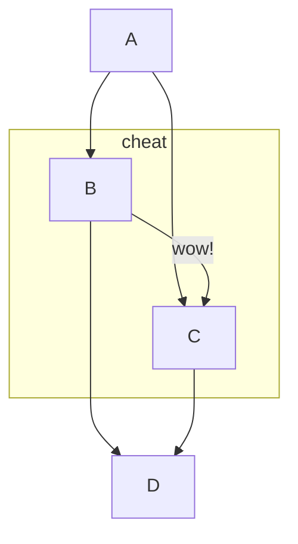
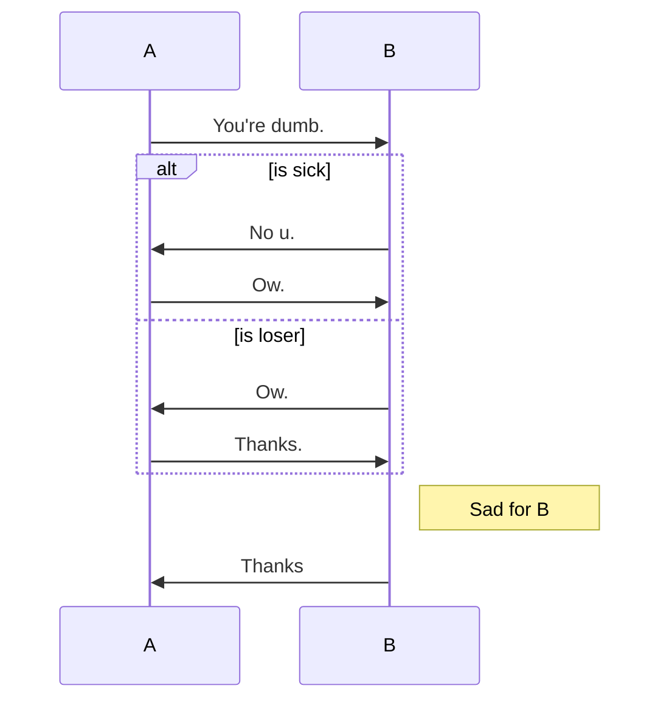

# Code
## Python
Here is some Python code

```python
a = 0
b = 100
for i in range(a, b):
	print(i)

```

# Mermaid
## Flowchart

```mermaid
graph TD;
	A-->B;
	A-->C;
	subgraph cheat
		B-->|wow!|C
	end
	B-->D;
	C-->D;
```
## Sequence Diagram

```mermaid
sequenceDiagram
	participant A
	participant B
	A->>B: You're dumb.
	alt is sick
		B->>A: No u.
		A->>B: Ow.
	else is loser
	 	B->>A: Ow.
		A->>B: Thanks.
	end
	Note right of B: Sad for B
	B->>A: Thanks
	
```
