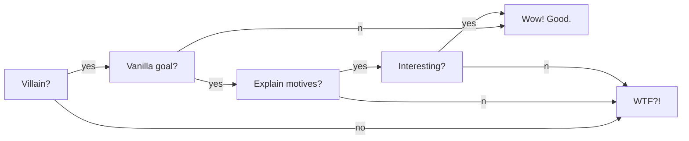

# Warning!
*SPOILERS AHEAD*
*SPOILERS AHEAD*
*SPOILERS AHEAD*
# Setup
## Who is the Night King?
The Night King we see today (and was just defeated) is supposed to be one of the First Men (possibly the First Hero?) that the Children of the Forrest transformed to protect them and get revenge on the humans that were destroying their land and the Weirwood trees.

# Execution
