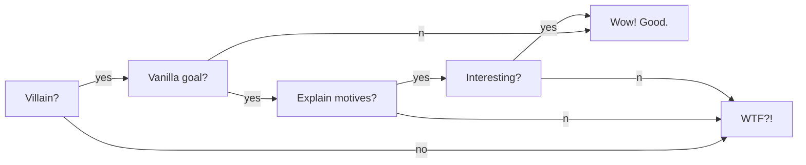

# Warning!
*SPOILERS AHEAD*

*SPOILERS AHEAD*

*SPOILERS AHEAD*

### Setup
#### Who is the Night King?
The Night King we see today (and was just defeated) is supposed to be one of the First Men (possibly the First Hero?). 
The Children of the Forrest transformed him to protect them and get revenge on the humans that were destroying their land and the Weirwood trees.

#### How important is the Night King?
Maybe less about the Night King, more sore the threat of the white walkers, They are the first thing they show (Pilot episode), they are a persitent threat throughout the whole show.
This makes it seem like they are a big deal, it's been happening for the past *8 years*. 

#### What is a White Walker?
A white walker is one of the more human-alive looking ice-bois that have been seen riding horses. They have wispy gray hair and look muscular like the Night King. They are assumed to be the child sacrifices that Crastor made to the Night King.

#### What is a Wight?
Wights are the dead that the Night King (and potentially White Walkers) bring back to life. They are supposed to die when their 
necromancer died. When the dude who brought you back to life dies you go back to being bones.

### So what's wrong?
Nothing is wrong *yet*.
However, killing the ultimate evil, the personification of death like they did last night was extremely anticlimactic.
There's nothing wrong with Arya killing him, sure that's fine, she's cool.
There's nothing wrong with *how* Arya killed him, she's sneaky, whatever.
Lore wise? Cat's paw is a great weapon choice to use! There's nothing really wrong with how it was done, it was a 10/10 cinematic experience.

The issue I have, is that the Night King is an in-limbo character now.
This is the first episode where we really see him walking around doing semi-normal-people-things.
If he is supposed to be death incarnate, showing no mercy why would he do something so brash as risk his own life and his whole plan to kill Bran himself?
Hold up! Before you say "but wants to wipe away the memory of the human experience!" 
Sure, but remove him from the equation, what happens? 
The wights were totally capable of destroying Winterfell and *everyone* in it, including Bran.
What about all the sacrifices Crastor made to him? Why on earth would the Night King go through all the effort of making this sick squad of clout bois? 
I'm pretty sure the White Walkers actually haven no confirmed kills, it's just the wights and the Night King. 
They seem to have been completely pointless.
On a less important note: the Night King smiles after Dany's fire doesn't burn him, he taunts Jon and he wants to slay Bran himself. 

These all sound like the kind of things a classic-cliche-villain would do.
Is the Night King the grim reaper? Or is he the Green Goblin trying to thwart Peter Parker? 
If it's the former, they need to make him cut the bullshit and stop all the weird grandstanding. 
Cancer and other diseases aren't dramatic they just kill, if the Night King is really the supernatural opposition to mankind he needs to be less human.
If it's the latter, they just need to give us some explanation as to why he's acted stupid (risked his life, basically behaved like a human would).
But hey I'm just stoked to see some high-fantasy on primetime TV so take my opinion with a grain of salt.

