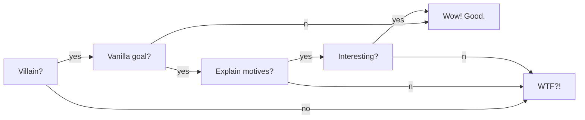

# Setup

```mermaid
graph LR
	start["Villain?"]--yes-->id1[Vanilla goal?]
	start-->|no|wtf
	id1--no-->good["Wow! Good."]
	id1--yes-->id2[Explain motives?]
	id2--no-->wtf["WTF?!"]
	id2--yes-->id3[Interesting?]
	id3--no-->wtf
	id3--yes-->good

```

# Execution
