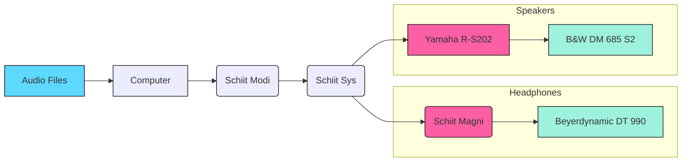

+++
title = "Schiit Stack"
date = 2019-07-20

[taxonomies]
categories = ["Gear"]
tags = ["review", "audio"]
+++

**This will serve as my first foray into reviewing objects.**

Anyone who knows me knows I'm a sucker for audio gear.
Every year I've been allowed to pollute my living space with things I like: I've made sure I had a dedicated audio setup.
There's something cerebral, to me, about tinkering with your audio setup that makes listening to music a bit more enjoyable. 
As with most tech products, I heard about Schiit from a Linus Tech Tips video. 
They're a goofy audio company that makes some serious entry-level products.
I'd never had a dedicated DAC before and I figured I'd see what all the fuss is about.
This led me to the pile of Schiit currently sitting on my desk.



## The Modi (DAC)
We'll start this review off with the bottom-most component, the [Schiit Modi](https://www.schiit.com/products/modi-1).
Priced at $99, the Modi offers a simple and effective way to take your digital audio, music on your computer, and turn it into an analog signal.
(By the way, DAC stands for Digital-to-Analog Converter).
People less familiar with audio and tech may be confused as to why one of these is necessary.
Can't you just connect a 3.5mm to RCA cable to your computer?
The problem with that is: you're trusting the DAC sitting behind that 3.5mm jack on your computer or phone.

If you've made the effort to purchase "higher-quality" speakers or headphones you're likely doing yourself a disservice.
The audio signal being converted by your computer's onboard DAC is probably poorer than that of a dedicated one.
Maybe you could look at a DAC as a fuel injector in a car, it's responsible for providing fuel into the engine.
It's important to remember that if you're using Spotify or random MP3s as your music source you won't see the benefits as clearly.
Going back to the car analogy, this is like putting low-octane gasoline in a vehicle rated for higher.

#### Features
The Modi offers three digital input sources: USB (which I use), Toslink SPDIF (optical) and Coaxial SPDIF (coax). 
When using USB you don't need to provide power separately.
If you use optical or coax, you need to provide power through a similar micro-USB input.
There are a pair of RCA outputs on the back as well. 
On the front, there is a switch to specify which input source you're using and a white LED for power.  

## The Magni (Headphone Amp)
Now to the middle, we have the [Schiit Magni](https://www.schiit.com/products/magni-1), a headphone amplifier. 
It's similarly reasonably priced at $99.
To be honest, I rarely use my headphones (perks of your roommates being your close pals).
On the off occasion that I do use them my amplifier is *way* too far away from my desk to plug my headphones into the onboard headphone amplifier there.
I also figured that if I ever switch amps to something that doesn't provide a headphone out I'd lose the ability to use them.
This headphone amplifier powers my Beyerdynamic DT 990 PRO 250 ohm headphones properly.
The listening experience on this, compared to the afterthought-headphone-amp on the Yamaha R-S202, seems to be superior.
Most importantly I enjoy having the volume control right on my desk.
One gripe I have is that I wish the headphone output was on the back so the *Schiit stack* would look a little cleaner. 

#### Features
The Magni has a pair of RCA jacks for your input. 
There are also another pair of RCA jacks for passthrough, for something like your speaker amp.
There's one switch to flip between high and low gain and another for power.
You power this thing with a provided AC adapter.
On the front, there is a volume knob and a white LED for power. 
The headphone output jack is also on the front.

## The Sys (I/O Switcher)
Jumping to the top, we have the [Schiit Sys](https://www.schiit.com/products/sys), it's a passive pre-amplifier.
This little guy handles switching my audio signal from one output to another.
It's priced at $49 and does the job well.
What's cool about the Sys is you can use it two ways: to switch between inputs and feed to one output or to switch between outputs from one input.

#### Features
The Sys has two pairs of RCA jacks labeled **input** and one pair labeled **output**.
If you want to switch between inputs: use the plugs as they are labeled.
If you want to switch between outputs: plug your outputs into the inputs and your input into the output.
On the front, there is a volume knob that I don't use and a toggle switch between your inputs (or outputs). 

## Tidbits
When I'm being lazy I listen to music on Spotify.
When I'm trying to listen intently I'll use Roon as an audio player for various FLAC files I've collected.
The computer is then plugged into the Schiit Modi via USB.
The Modi feeds into the Schiit Sys which toggles the output between my headphones and speakers.
My B&W DM 685 S2 (speakers, from around 2005) are powered by a Yamaha R-S202.
The Beyerdynamic DT 990s (headphones) are powered by the Schiit Magni.

**I'm cripplingly addicted to making diagrams, so here's one:** 

